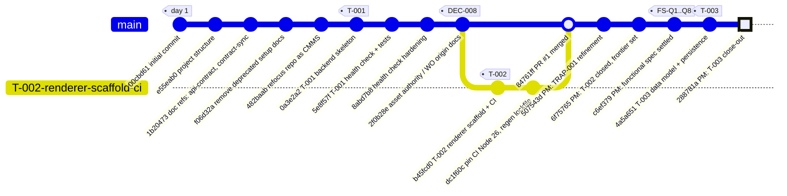
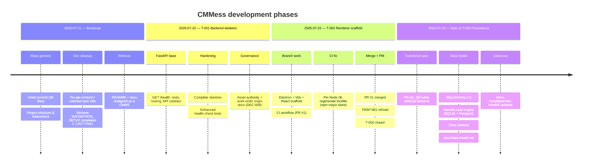
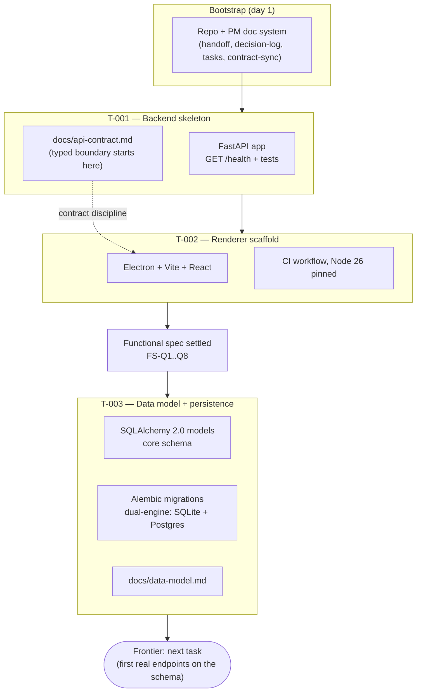

# Development History — CMMess (temp doc)

> **Temporary doc.** Rendered snapshot of the commit history as of 2026-07-22 (`288781a`).
> Regenerate or delete once stale; the git log is the authority.

## Commit graph

## Phases in order

## What each task delivered

## Quick reference

| Task | Commits | Outcome |
|---|---|---|
| Bootstrap | `00cbd61`…`482baab` | Repo, PM doc system, CMMS refocus |
| T-001 | `0a3e2a2`, `5e8f57f`, `8abd7b8` | FastAPI backend skeleton, `/health`, tests, API contract |
| DEC-008 docs | `2f0b28e` | Asset authority by provenance; typed work-order origin |
| T-002 (PR #1) | `b45fcd0`, `dc1f60c`, merge `84761ff` | Electron+Vite+React renderer, CI on Node 26 |
| Functional spec | `c6ef379` | FS-Q1–Q8 ruled, defaults settled |
| T-003 | `4a5a651` | SQLAlchemy 2.0 + Alembic dual-engine, core schema, `docs/data-model.md` |
| PM close-outs | `507543d`, `6f75765`, `288781a` | Handoff/index kept current after each merge |
